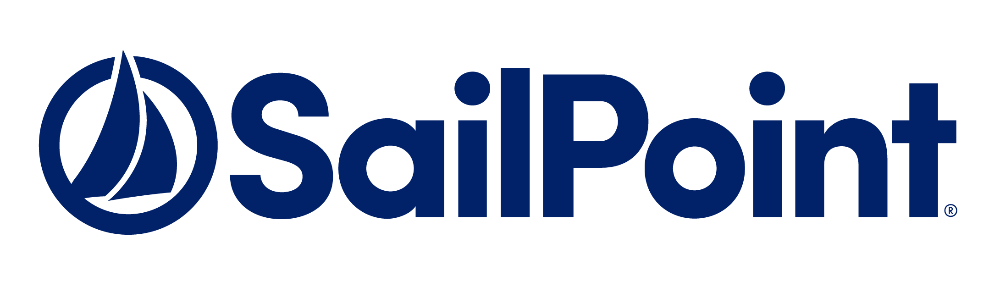

#  BLS360 🚀


> A collaborative project space for SailPoint IdentityIQ developers to upload and track tasks, share code, and document solutions. This repository aims to streamline collaboration and ensure adherence to best practices for IdentityIQ development.

---


## 👋 Introduction

Welcome to **BLS360**! This repository serves as a collaborative space for SailPoint IdentityIQ developers to share their work, track ongoing tasks, and follow best practices for SailPoint development. By contributing to this repository, you will help create a shared knowledge base, making future IdentityIQ development more efficient and streamlined.

## 📌 Project Scope

- **Task Sharing** 📂: Upload and manage IdentityIQ tasks, such as rules, workflows, and report generation.
- **Code Sharing** 💻: Share reusable code snippets, connectors, and SailPoint-specific customizations.
- **Documentation** 📝: Record solutions for common issues and provide detailed explanations for complex SailPoint development topics.

## ⚙️ Setup and Installation

1. **Clone the Repository**:
   ```bash
   git clone https://github.com/Malarvanan/BLS360.git
   ```
2. **Navigate to the Project Directory**:
   ```bash
   cd BLS360
   ```


## 📏 Usage Guidelines

- **Branching** 🌿: Create a new branch for each task or feature. Branch names should be descriptive and follow the format:
  - `feature/<task-name>` (e.g., `feature/entitlement-report`)
  - `bugfix/<bug-name>` (e.g., `bugfix/correlation-issue`)
  
  Example:
  ```bash
  git checkout -b feature/entitlement-report
  ```

- **Commit Messages** 📝: Use clear, concise commit messages with a description of what was changed. Follow the format:
  - `[Task ID] - <short description>` (e.g., `[T123] - Added entitlement correlation logic`).

  Example:
  ```bash
  git commit -m "[T123] - Fixed entitlement aggregation bug"
  ```

- **Code Review** 🔍: Open a pull request when your task is complete. Be sure to include a description of what changes have been made and tag the relevant team members for review.

## 📂 Folder Structure

```
/BLS360
│
├── /tasks
│   ├── /task-001
│   │   ├── README.md   # Details about task 001
│   │   └── code-files  # Code, scripts, or configurations for task 001
│   ├── /task-002
│   │   ├── README.md   # Details about task 002
│   │   └── code-files
│
└── /docs
    ├── best-practices.md  # SailPoint IIQ coding standards and best practices
   
```

- **tasks/**: Each task should be placed in its own folder with a `README.md` detailing the task description, steps, and solutions.
- **docs/**: Documentation, including coding standards, best practices, and templates for task documentation.

## 🏗️ Code Structure & Naming Conventions

To ensure consistency and maintainability, please follow these guidelines when writing or contributing to SailPoint IdentityIQ code:

### 1. **Naming Conventions**
   - **Java Classes**: Use PascalCase for class names. For example:
     - `AccountCorrelationRule`
     - `ProvisioningTask`
   - **Methods**: Use camelCase for method names, and ensure methods are action-oriented:
     - `getIdentityData()`
     - `processEntitlements()`
   - **Variables**: Use camelCase for variable names, starting with a lowercase letter:
     - `accountList`
     - `userIdentity`
   - **Constants**: Use uppercase with underscores for constants:
     - `MAX_ENTITLEMENTS`
   - **Files and Directories**: Use lowercase with hyphens to separate words:
     - `account-correlation-rule.java`
     - `user-report-generation.xml`

### 2. **Code Structure**
   - **Custom Rules** 🛠️: Place rules in their dedicated directory under `/tasks`. Ensure that rules are modular and follow the principle of single responsibility.
   - **Error Handling** 🚨: Use try-catch blocks where necessary, and always log errors to ensure traceability.
   - **Configuration Files** 📑: Store SailPoint configuration files (e.g., XML, JSON) under `/config`. Avoid hardcoding values; use configuration files wherever possible.
   - **Reusable Components** 🔄: If a piece of logic or function is used in multiple places, consider creating a utility class (e.g., `Utils.java`).

### 3. **JavaDocs and Documentation**
 
   - Refer to the official SailPoint JavaDocs for additional context and examples:  
     [SailPoint IIQ JavaDocs](https://developer.sailpoint.com/docs/extensibility/rules/java-docs/)

---

## 🤝 Contributing

We welcome contributions from all members. Please follow these steps to contribute:

1. **Fork the Repository** 🍴: Fork this repository to your GitHub account.
2. **Create a Branch** 🌱: Create a new branch for each task or feature.
   ```bash
   git checkout -b feature/task-003
   ```
3. **Make Changes and Commit** 💡: Make your changes and commit with a meaningful message.
   ```bash
   git commit -m "Implemented feature/task-003"
   ```
4. **Push to GitHub** ⬆️:
   ```bash
   git push origin feature/task-003
   ```
5. **Open a Pull Request** 🔄: Open a pull request with a description of your changes for review.

## 📚 Tasks and Documentation

Each task should include:
- **Code files**: Any scripts, rules, or configurations relevant to the task.
- **README.md**: A detailed explanation of the task, solution, and any special instructions.
- **JavaDocs**: All custom classes and methods should be documented according to JavaDoc standards. Refer to the [SailPoint IIQ JavaDocs](https://developer.sailpoint.com/docs/extensibility/rules/java-docs/) for more details on custom rule creation.

## 📝 License

This repository is for internal collaboration and knowledge sharing. Redistribution outside the team is prohibited.


---

**Happy collaborating on BLS360! Let’s improve our SailPoint IdentityIQ development processes together!** 🚀
```

